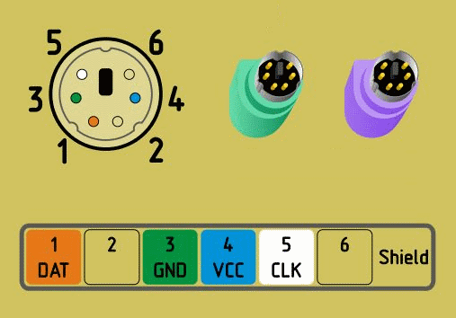
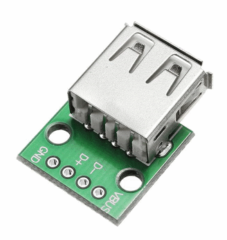

# micropython-keyboard-ps2
Full library for PS/2 keyboard on Micropython.



This works for some USB-keyboards. You need to use a simple USB-adapter for this.



## Connection
|PS/2|USB|Controller|
| ------ | ------ |------ |
|Pin 3|GND|GND|
|Pin 5|D+|Clock|
|Pin 1|D-|Data|
|Pin 4|VCC|5v|

## Example of code
```python
from keyboard_ps2 import KEYBOARD_PS2

keyboard = KEYBOARD_PS2( clock_pin = 17, data_pin = 16 )

while True:
    keys = keyboard.listening()   
    print( keys ) # Something like: ['ctrl', 'alt', 'v']
```
